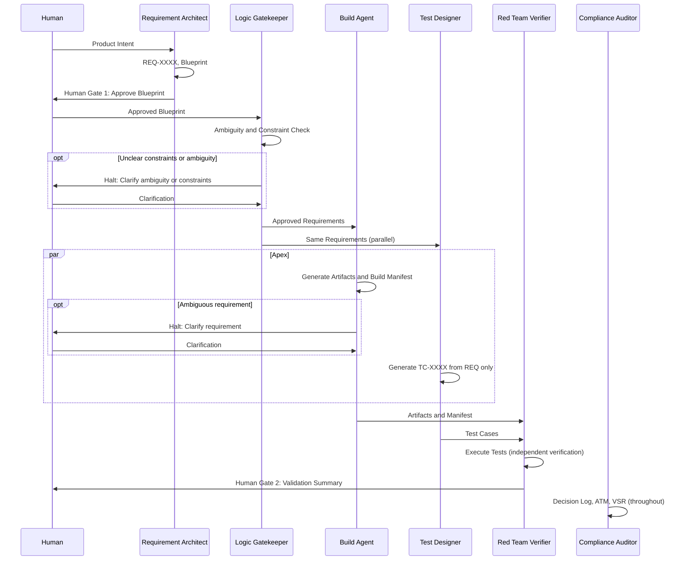

# Agile V™ Agent Skills Library

### *Verifiable AI-Augmented Engineering*

[](https://agile-v.org/)
[](https://agentskills.io/specification)
[](https://creativecommons.org/licenses/by-sa/4.0/)

This repository contains the official collection of **Agent Skills** for the Agile V™ framework. These skills are designed to transform standard LLMs into specialized engineering agents capable of building, verifying, and auditing complex systems with mathematical rigor.


## The Vision: From Manifesto to Execution

The [Agile V™ Manifesto](https://agile-v.org) provides the philosophy; this repository provides the **mechanics**. 

By deploying these skills, you move away from "unstructured prompting" and toward a formal **Autonomous Quality Management System (AQMS)**. Every skill in this library is built to enforce:
* **Traceability:** Every action is linked to a Requirement ID.
* **Verification:** No artifact is created without a "Red Team" challenge.
* **Human Curation:** Automated stops at critical "Human Gates."


## 🛠 Repository Structure

The skills are organized following the **Agile V™ Infinity Loop**:

```text
├── foundation/          # Core philosophy (The "Agile V™ Core")
├── left-side/           # Intent & Decomposition (Requirement Architect, Logic Gatekeeper)
├── apex/                # Synthesis & Build (Build Agent, Test Designer, Schematic Generator, domain extensions)
├── right-side/          # Verification & Red Teaming (Red Team Verifier)
└── compliance/          # Audit & Governance (Compliance Auditor, ISO-Linker)
```


## 📦 Included Skills
| Skill               | Category    | Purpose                                                                 |
|---------------------|-------------|-------------------------------------------------------------------------|
| agile-v-core        | Foundation  | The baseline "operating system" for all agents.                           |
| requirement-architect | Left Side | Converts intent into atomic, traceable requirements.                    |
| logic-gatekeeper    | Left Side   | Validates requirements against physical/hardware constraints.           |
| build-agent         | Apex        | Generates code, firmware, HDL from approved requirements (language-agnostic). |
| test-designer       | Apex        | Designs verification suite from requirements only—runs parallel to Build Agent. |
| schematic-generator | Apex        | Generates schematics, netlists, HDL for hardware/PCB projects.           |
| build-agent-dart    | Apex        | Dart/Flutter build agent for mobile apps and packages.                  |
| build-agent-js      | Apex        | JavaScript/TypeScript/Web build agent for web apps and backends.         |
| build-agent-python  | Apex        | Python build agent for scripts, backends, data pipelines, and ML.       |
| build-agent-embedded| Apex        | C/C++ build agent for embedded systems, firmware, and MCU projects.     |
| red-team-verifier   | Right Side  | Challenges build artifacts using independent verification.              |
| compliance-auditor  | Compliance  | Automates real-time decision logging for ISO/GxP.                        |


## Skill Interaction Flow




## How to Use
To learn how to use skills please follow the [instructions and documentation](https://agentskills.io/integrate-skills) of Agent Skills.


## 🏢 Enterprise & Team Integration: Standardizing Excellence

Agile V™ is built to function as the quality layer between your team’s expertise and any AI agent they use. Whether teams rely on proprietary LLMs, local models, or different IDEs, the **engineering standard remains consistent** across the organization.
Thanks to Agent Skills every agent behaves according to the same engineering principles, no matter where or how it runs.

### 🧩 Encoding Company Knowledge into "Agent DNA"
Organizations can extend the public Agile V™ foundation with private **Company Skills** that embed institutional knowledge directly into agent behavior.

* **Internal Compliance:** Wrap Agile V™ skills with company-specific safety protocols, regulatory checklists, or GxP requirements so every agent interaction is compliant by default.
* **Legacy Wisdom:** Capture “lessons learned” from past projects in a **Gatekeeper Skill** that prevents agents from repeating known failure modes or architectural mistakes.
* **Tool Agnostic Logic:** Because Agile V™ focuses on *Logic Gates* and *Traceability*, it works whether your team uses GitHub Copilot, Cursor, custom LangChain flows, or manual prompting.

Your standards live in the skills—not in the tool.

### 🛡️ Quality as a Constant
Agile V™ establishes a minimum quality floor across all teams and agents.
1.  **Uniform Audits:** Every developer, regardless of experience level, uses agents that follow the same **Red Team Protocol** and quality checks.
2.  **Decoupled Intelligence:** When switching from one AI model to another, your **Agile V™ Skills** preserve engineering constraints, review gates, and your Definition of Done.
3.  **Institutional Memory:** With Principle #9 (Decision Logging), the reasoning behind engineering choices is stored in the repository, not in individual developers’ heads, ensuring long-term maintainability.

> [!TIP] 
> Teams can maintain a private `/internal-skills` directory that inherits from the `/foundation` skills. This enables a **“Global Standard, Local Context”** workflow; shared principles with company-specific adaptations.


## 🤝 Contributing New Skills
We welcome contributions! To add a new skill to the Agile V™ ecosystem, it must adhere to the following rules:

1. **Strict Traceability:** The skill must include procedures for logging the "Why" behind every output.

2. **Verification Step:** If the skill generates an artifact, it must include a sub-process for checking that artifact against its parent requirement.

3. **No Hallucination:** The skill must be instructed to "Halt and Ask" when requirements are ambiguous.

4. **Format:** Must include a SKILL.md with valid YAML frontmatter as per the [agentskills.io spec](https://agentskills.io/specification).

5. **License:** The skill must be licensed under **CC-BY-SA-4.0** (Creative Commons Attribution-ShareAlike 4.0). Include `license: CC-BY-SA-4.0` in the frontmatter.

6. **Metadata:** The skill must include `metadata.author` (e.g., `agile-v.org`) and `metadata.version` (e.g., `"1.0"`).

> [!NOTE]
> **Contribution guidelines in progress:** We are currently developing comprehensive contribution guidelines for the community. The rules above are the current minimum requirements. A full spec, including review process, quality checklist, and community standards, will be published soon. Watch this space or check [agile-v.org](https://agile-v.org) for updates.

## 📜 License
The Agile V™ Agent Skills Library is published under the **[Creative Commons Attribution-ShareAlike 4.0 International (CC BY-SA 4.0)](https://creativecommons.org/licenses/by-sa/4.0/legalcode.en)** license.