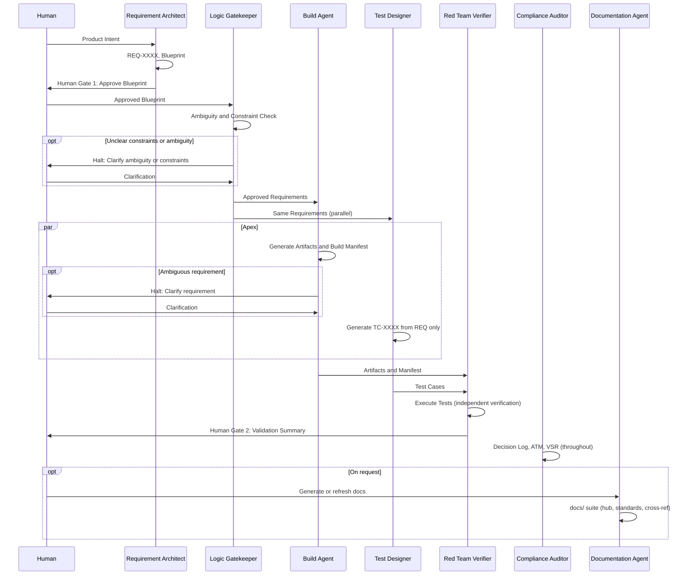

# Agile V™ Agent Skills Library

### *Verifiable AI-Augmented Engineering*

[](https://agile-v.org/)
[](https://agentskills.io/specification)
[](https://creativecommons.org/licenses/by-sa/4.0/)

This repository contains the official collection of **Agent Skills** for the Agile V™ framework. These skills are designed to transform standard LLMs into specialized engineering agents capable of building, verifying, and auditing complex systems with mathematical rigor.


## The Vision: From Manifesto to Execution

The [Agile V™ Manifesto](https://agile-v.org) provides the philosophy; this repository provides the **mechanics**. 

By deploying these skills, you move away from "unstructured prompting" and toward a formal **Autonomous Quality Management System (AQMS)**. Every skill in this library is built to enforce:
* **Traceability:** Every action is linked to a Requirement ID.
* **Verification:** No artifact is created without a "Red Team" challenge.
* **Human Curation:** Automated stops at critical "Human Gates."


## 🛠 Repository Structure

The skills are organized following the **Agile V™ Infinity Loop**. Each skill lives at the root level (or under `domains/` for language-specific extensions) for ease of use. You can reference skills directly with simple paths like `./agile-v-core/SKILL.md` when configuring Cursor or other agent tools.

```text
├── agile-v-core/           # Foundation: Core philosophy and operational logic
├── requirement-architect/  # Left Side: Intent and decomposition
├── logic-gatekeeper/       # Left Side: Ambiguity and constraint validation
├── build-agent/            # Apex: Core build agent (language-agnostic)
├── test-designer/          # Apex: Verification suite design
├── schematic-generator/    # Apex: Schematics, netlists, HDL
├── domains/                # Apex: Language-specific build agent extensions
│   ├── build-agent-dart/
│   ├── build-agent-embedded/
│   ├── build-agent-js/
│   └── build-agent-python/
├── red-team-verifier/      # Right Side: Verification and Red Teaming
├── compliance-auditor/     # Compliance: Audit and governance
└── documentation-agent/    # Documentation: Standards-based repo docs (ISO 9001, V-Model, ISO 27001)
```


## 📦 Included Skills
| Skill               | Category    | Path                         | Purpose                                                                 |
|---------------------|-------------|------------------------------|-------------------------------------------------------------------------|
| agile-v-core        | Foundation  | `agile-v-core/`              | The baseline "operating system" for all agents. Includes context engineering, orchestration pipeline, state persistence, and model tier guidance.                           |
| requirement-architect | Left Side | `requirement-architect/`     | Converts intent into atomic, traceable requirements.                    |
| logic-gatekeeper    | Left Side   | `logic-gatekeeper/`          | Validates requirements for ambiguity and physical/hardware constraints.    |
| build-agent         | Apex        | `build-agent/`               | Generates code, firmware, HDL from approved requirements (language-agnostic). Includes context engineering, pre-execution validation, and post-verification feedback loop. |
| test-designer       | Apex        | `test-designer/`             | Designs verification suite from requirements only—runs parallel to Build Agent. |
| schematic-generator | Apex        | `schematic-generator/`       | Generates schematics, netlists, HDL for hardware/PCB projects.           |
| build-agent-dart    | Apex        | `domains/build-agent-dart/`  | Dart/Flutter build agent for mobile apps and packages.                  |
| build-agent-js      | Apex        | `domains/build-agent-js/`    | JavaScript/TypeScript/Web build agent for web apps and backends.         |
| build-agent-python  | Apex        | `domains/build-agent-python/`| Python build agent for scripts, backends, data pipelines, and ML.       |
| build-agent-embedded| Apex        | `domains/build-agent-embedded/`| C/C++ build agent for embedded systems, firmware, and MCU projects.     |
| red-team-verifier   | Right Side  | `red-team-verifier/`        | Challenges build artifacts; produces Validation Summary for Human Gate 2. Includes stub/anti-pattern detection and post-verification feedback protocol. |
| compliance-auditor  | Compliance  | `compliance-auditor/`        | Automates decision logging, traceability matrix (ATM), and VSR for ISO/GxP. |
| documentation-agent | Compliance  | `documentation-agent/`      | Generates standards-based repo documentation (ISO 9001, V-Model, ISO 27001, optional GAMP 5) into `docs/` with hub README, cross-reference matrix, and Mermaid diagrams. |


## Skill Interaction Flow



### Requirements artifact (source of truth)
The Requirement Architect exports the approved Blueprint (after Human Gate 1) to a **requirements file** (default: `REQUIREMENTS.md` in the project root). The Logic Gatekeeper then **reads** that file, validates it (ambiguity, constraints, conflicts), and **writes back** any user-approved adjustments to the same file. All downstream agents (Build Agent, Test Designer, Red Team Verifier, Schematic Generator, Compliance Auditor) **read requirements from this file**, not from in-chat handoff. Using a single persisted file as the requirements source reduces context-window pressure, avoids carrying the full Blueprint in conversation, and lets parallel or sequential agent runs (e.g. build per feature) reference the same canonical artifact.

### Documentation artifact (documentation-agent)
The Documentation Agent writes all output into the project's **`docs/`** directory (created if missing). The hub **`docs/README.md`** provides the document map, quick navigation and per-standard tables, cross-reference matrix (concerns × standards), repository structure reference, and applicable standards table. One subdirectory per selected standard, e.g. **`iso9001/`**, **`iso27001/`**, **`v-model/`** by default; (optionally **`gamp5/`** or other standards when the user requests it) contains numbered markdown documents for that standard. Every generated document (except the hub) includes a header (Document ID, Version, Date, Classification, Status), navigation (Back to Documentation Hub, Previous/Next when applicable), and a footer with a Document History table; any diagrams are Mermaid only, embedded in markdown. The default standards are ISO 9001, V-Model (lifecycle), and ISO 27001; additional standards (e.g. GAMP 5) are included only when the user specifies them.

### Context Engineering and Orchestration (v1.2)

Version 1.2 introduces **context engineering**, **orchestration pipeline**, **state persistence**, and **post-verification feedback** patterns adapted from [Get Shit Done (GSD)](https://github.com/gsd-build/get-shit-done) by Lex Christopherson ([MIT License](https://github.com/gsd-build/get-shit-done/blob/main/LICENSE)). These additions address how agents manage context windows, coordinate handoffs, persist project state across sessions, and iterate after verification failures.

**Key additions:**
- **Context Engineering** (`agile-v-core`, `build-agent`, all domain agents): Rules for managing context window quality -- thin orchestrator pattern, fresh context per task, task sizing to 50% of context, passing file paths instead of contents.
- **Orchestration Pipeline** (`agile-v-core`): Defines pipeline stages, handoff rules, wave-based parallel execution with dependency analysis, and checkpoint types (auto, human-verify, human-decision, human-action).
- **State Persistence** (`agile-v-core`): Standard `.agile-v/` project directory structure for persisting requirements, build manifests, decision logs, traceability matrices, and session state across sessions.
- **Pre-Execution Validation** (`build-agent`): 5-dimension check before synthesis -- requirement coverage, artifact completeness, dependency order, scope sanity, and interface contracts.
- **Post-Verification Feedback Loop** (`build-agent`, `red-team-verifier`): Auto-fix rules, severity classification (CRITICAL/MAJOR/MINOR), 3-attempt limit per failure, and re-verification protocol with append-only records.
- **Stub and Anti-Pattern Detection** (`red-team-verifier`): 11-item detection checklist for placeholder returns, TODO markers, empty handlers, hardcoded secrets, and more.
- **Model Tier Guidance** (`agile-v-core`): Recommended model capability tiers per agent role (High for architecture decisions, Medium for code generation, Low for structured logging).

### Iteration Lifecycle and Document Versioning (v1.3)

Version 1.3 introduces the **multi-cycle V-loop** -- the ability to run second and subsequent iterations while preserving full traceability, versioned documents, and audit evidence from prior cycles.

**Key additions:**
- **Iteration Lifecycle** (`agile-v-core`): Defines Cycle IDs (`C1`, `C2`, ...), cycle triggers, re-entry points, document versioning scheme, and cycle archival to `.agile-v/cycles/CN/`. Requirements carry per-REQ status tags (`approved`, `modified`, `new`, `deprecated`, `superseded`) with cycle references.
- **Change Request Protocol** (`agile-v-core`, `requirement-architect`): `CR-XXXX` records in `.agile-v/CHANGE_LOG.md` that formally track every requirement modification between cycles with rationale, impact analysis, and Human Gate approval.
- **Multi-Cycle Re-Validation** (`logic-gatekeeper`): Scoped re-validation -- only `new` and `modified` requirements go through full validation; unchanged requirements are skipped unless constraints shifted.
- **Artifact Versioning** (`build-agent`): `ART-XXXX.N` revision scheme -- unchanged artifacts carry forward without rebuild; modified artifacts get a revision bump with CR reference.
- **Regression and Delta Testing** (`test-designer`): Test cases classified as `delta` (new/modified REQs) or `regression` (unchanged REQs). Regression baseline carried forward from prior cycle. Retired tests preserved for traceability.
- **Cycle-Aware Verification** (`red-team-verifier`): Delta and regression results reported separately. Unexpected regression failures (no related CR) are automatically **CRITICAL**.
- **Cycle-Aware ATM** (`compliance-auditor`): Traceability matrix partitioned by cycle. CR end-to-end chain validation. Cycle boundary audit checklist. VSR extended with Cycle History table.

> [!IMPORTANT]
> **Maintain Rigorous Test Independence:**  
> When running the workflow within a **single chat** or environment, **always execute the Test Designer *before* launching the Build Agent**. This ensures the Test Designer derives its test suite solely from the requirements and not from any artifacts, code, or outputs generated by the Build Agent.  
> By preserving this strict order, you safeguard the impartiality of the verification process and prevent accidental cross-contamination, thereby maximizing the integrity and trustworthiness of your independent test coverage.

> [!TIP]
> **Scaling the build phase:** With a large number of features or requirements, consider running the build agent **per feature or per small subset** (sequentially) to improve focus and quality. Running **multiple build-agent instances in parallel** can speed things up but may introduce race conditions (e.g. concurrent edits to the same files); use with care and plan your merge or review strategy accordingly. See the **Wave-Based Parallel Execution** section in `agile-v-core` for dependency-aware parallelism guidance.

## How to Use
Below are practical ways to use these skills in common editors and agents.

### Using Agile V™ skills in your editor or agent

- **Cursor**  
  Skills are discovered from `.cursor/skills/` (project) or `~/.cursor/skills/` (global). Each skill is a folder containing a `SKILL.md` file with YAML frontmatter. The agent auto-applies relevant skills; you can also invoke a skill manually by typing `/` in Agent chat and searching for the skill name. Clone this repo and copy the skill folders you need (e.g. `agile-v-core/`, `requirement-architect/`, `domains/build-agent-python/`) into `.cursor/skills/`.
  For more information on how to use Skills in Cursor please refer to the [official documentation](https://cursor.com/docs/context/skills).

- **Claude Code**  
  Skills are discovered from `.claude/skills/` (project) or `~/.claude/skills/` (global). Each skill is a folder containing a `SKILL.md` file with YAML frontmatter. The agent auto-applies relevant skills; you can also invoke a skill manually by typing `/` in Agent chat and searching for the skill name. Clone this repo and copy the skill folders you need (e.g. `agile-v-core/`, `requirement-architect/`, `domains/build-agent-python/`) into `.cursor/skills/`.
  For more information on how to use Skills in Cursor please refer to the [official documentation](https://code.claude.com/docs/en/skills).

- **VS Code**  
  VS Code supports two types of skills. Project skills, stored in your repository like `.github/skills/`, `.claude/skills`, `.agents/skills/` or personal skills stored globally like `~/.copilot/skills/`, `~/.claude/skills`, `~/.agents/skills/`.
  The agent auto-applies relevant skills; you can also invoke a skill manually by typing `/` in Agent chat and searching for the skill name. Clone this repo and copy the skill folders you need (e.g. `agile-v-core/`, `requirement-architect/`, `domains/build-agent-python/`) into one of the directories mentioned above.
  For more information on how to use Skills in VS Code please refer to the [official documentation](https://code.visualstudio.com/docs/copilot/customization/agent-skills).

- **GitHub Copilot**  
  Github Copilot supports two types of skills. Project skills, stored in your repository like `.github/skills/`, `.claude/skills` or personal skills stored globally like `~/.copilot/skills/`, `~/.claude/skills`.
  The agent auto-applies relevant skills; you can also invoke a skill manually by typing `/` in Agent chat and searching for the skill name. Clone this repo and copy the skill folders you need (e.g. `agile-v-core/`, `requirement-architect/`, `domains/build-agent-python/`) into one of the directories mentioned above.
  For more information on how to use Skills with Github Copilot please refer to the [official documentation](https://docs.github.com/en/copilot/concepts/agents/about-agent-skills).

- **Other tools (Claude Agent SDK, Windsurf, Continue, Cody, Zed, etc.)**  
  For other tools please refer to the official documentation of your desired tool.

To learn more about skills and how to use skills in general, please follow the [instructions and documentation](https://agentskills.io/integrate-skills) of Agent Skills.


## 🏢 Enterprise & Team Integration: Standardizing Excellence

Agile V™ is built to function as the quality layer between your team’s expertise and any AI agent they use. Whether teams rely on proprietary LLMs, local models, or different IDEs, the **engineering standard remains consistent** across the organization.
Thanks to Agent Skills every agent behaves according to the same engineering principles, no matter where or how it runs.

### 🧩 Encoding Company Knowledge into "Agent DNA"
Organizations can extend the public Agile V™ skills (e.g., `agile-v-core`) with private **Company Skills** that embed institutional knowledge directly into agent behavior.

* **Internal Compliance:** Wrap Agile V™ skills with company-specific safety protocols, regulatory checklists, or GxP requirements so every agent interaction is compliant by default.
* **Legacy Wisdom:** Capture “lessons learned” from past projects in a **Gatekeeper Skill** that prevents agents from repeating known failure modes or architectural mistakes.
* **Tool Agnostic Logic:** Because Agile V™ focuses on *Logic Gates* and *Traceability*, it works whether your team uses GitHub Copilot, Cursor, custom LangChain flows, or manual prompting.

Your standards live in the skills, not in the tool.

### 🛡️ Quality as a Constant
Agile V™ establishes a minimum quality floor across all teams and agents.
1.  **Uniform Audits:** Every developer, regardless of experience level, uses agents that follow the same **Red Team Protocol** and quality checks.
2.  **Decoupled Intelligence:** When switching from one AI model to another, your **Agile V™ Skills** preserve engineering constraints, review gates, and your Definition of Done.
3.  **Institutional Memory:** With Principle #9 (Decision Logging), the reasoning behind engineering choices is stored in the repository, not in individual developers’ heads, ensuring long-term maintainability.

> [!TIP] 
> Teams can maintain a private `/internal-skills` directory that inherits from the root-level skills (e.g., `agile-v-core/`). This enables a **“Global Standard, Local Context”** workflow; shared principles with company-specific adaptations.


## 🤝 Contributing New Skills
We welcome contributions! To add a new skill to the Agile V™ ecosystem, it must adhere to the following rules:

1. **Strict Traceability:** The skill must include procedures for logging the "Why" behind every output.

2. **Verification Step:** If the skill generates an artifact, it must include a sub-process for checking that artifact against its parent requirement.

3. **No Hallucination:** The skill must be instructed to "Halt and Ask" when requirements are ambiguous.

4. **Format:** Must include a SKILL.md with valid YAML frontmatter as per the [agentskills.io spec](https://agentskills.io/specification).

5. **License:** The skill must be licensed under **CC-BY-SA-4.0** (Creative Commons Attribution-ShareAlike 4.0). Include `license: CC-BY-SA-4.0` in the frontmatter.

6. **Metadata:** The skill must include `metadata.author` (e.g., `agile-v.org`) and `metadata.version` (e.g., `"1.0"`).

> [!NOTE]
> **Contribution guidelines in progress:** We are currently developing comprehensive contribution guidelines for the community. The rules above are the current minimum requirements. A full spec, including review process, quality checklist, and community standards, will be published soon. Watch this space or check [agile-v.org](https://agile-v.org) for updates.

## 📜 License
The Agile V™ Agent Skills Library is published under the **[Creative Commons Attribution-ShareAlike 4.0 International (CC BY-SA 4.0)](https://creativecommons.org/licenses/by-sa/4.0/legalcode.en)** license.