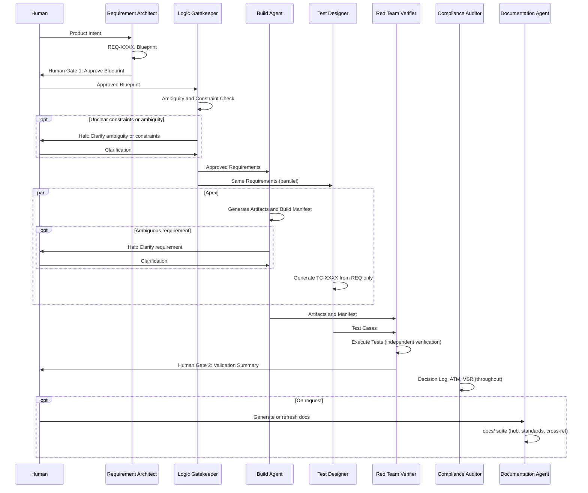

# Agile V™ Agent Skills Library

### *🔬 Verifiable AI-Augmented Engineering - Stop AI Hallucinations with Formal Traceability*

[](https://agile-v.org/)
[](https://agentskills.io/specification)
[](https://creativecommons.org/licenses/by-sa/4.0/)
[](https://github.com/Agile-V/agile_v_skills/releases)
[](https://github.com/Agile-V/agile_v_skills/stargazers)

[](./docs/compliance/02_ISO_9001_MATRIX.md)
[](./docs/compliance/05_ISO_27001_MATRIX.md)
[](./docs/compliance/06_GXP_GAMP5_MATRIX.md)
[](CLAUDE.md)
[](CURSOR.md)
[](README.md#how-to-use)
[](README.md#how-to-use)

---

## 🎯 **The Problem with AI Agents Today**

**AI agents hallucinate.** They generate code without requirements, skip testing, make silent assumptions, and deploy to production without approval. Great for demos. **Catastrophic for real products.**

### Real-World Failure Scenarios

Without formal verification frameworks, AI agents commonly produce:

- **Orphaned Code**: Functions and features appear with no documented requirement or business justification. Six months later, no one knows why they exist or if they can be safely removed.
- **Silent Assumptions**: An agent optimizes for cloud deployment without asking about target hardware, producing code that crashes on embedded devices with limited RAM.
- **Self-Grading Bias**: The same agent that writes code also writes its own tests, missing edge cases and security vulnerabilities a fresh perspective would catch.
- **Deployment Disasters**: Autonomous agents push changes to production at 2 AM without human review, breaking critical systems because they "passed all tests."
- **Untraceable Bugs**: When a feature breaks, there's no audit trail showing *why* design decisions were made, making debugging a archaeological expedition.
- **Compliance Nightmares**: Regulatory auditors ask "Where's your requirements traceability matrix?" and teams spend weeks manually reconstructing what should have been automated from day one.

## ✨ **The Solution: Agile V Framework**

Transform unreliable AI agents into **Verifiable Engineering Systems** with:

### Core Protection Mechanisms

- ✅ **Formal Traceability** — Every line of code links to `REQ-XXXX` → `ART-XXXX` → `TC-XXXX`
  - *Why it matters:* When a bug appears in production, you can instantly trace it back to the original requirement, see which tests should have caught it, and understand the design rationale. No more archeological debugging.
  
- ✅ **Independent Verification** — Red Team Verifier tests what Build Agent creates (no self-grading)
  - *Why it matters:* Two separate agents with fresh contexts means bugs the Build Agent missed get caught before production. It's like having a dedicated QA engineer who hasn't seen the implementation details.
  
- ✅ **Hardware Awareness** — Agents ask about RAM/CPU/GPU before optimizing (no "works on my machine")
  - *Why it matters:* Code optimized for cloud servers crashes on Raspberry Pi. Code written for development laptops fails on production embedded devices. Agile V validates constraints upfront.
  
- ✅ **Human Gates** — Evidence Summaries before deployments (no autonomous production releases)
  - *Why it matters:* You get a comprehensive summary of what changed, what was tested, and what risks remain *before* approving deployment. No more surprise 2 AM production incidents.
  
- ✅ **Halt on Ambiguity** — Agents stop and ask when requirements are unclear (no silent assumptions)
  - *Why it matters:* "Make it faster" could mean response time, perceived UX speed, or infrastructure throughput. Agile V agents clarify *before* building, preventing wasted work.
  
- ✅ **Compliance-Ready** — Auto-generates ISO 9001, ISO 27001, GxP artifacts from day 1
  - *Why it matters:* When auditors ask "Show me your requirements traceability matrix," you have it. When regulators demand evidence of independent verification, you have it. Compliance becomes a byproduct of normal development.
  
- ✅ **Multi-Platform** — Works with Claude Code, Cursor, VS Code, GitHub Copilot
  - *Why it matters:* Your engineering standards stay consistent regardless of which IDE or AI provider your team uses. The quality framework is portable.

---

## 🚀 **Quick Start**

### Prerequisites

Before installing Agile V skills, ensure you have:
- One of the supported AI coding tools (Claude Code, Cursor, VS Code, or GitHub Copilot)
- Basic familiarity with your chosen tool's agent/chat interface
- A project directory where you want to apply Agile V principles

### Installation (Choose Your Platform)

#### Option 1: Claude Code (Simplest)
```bash
# Install via plugin marketplace
/plugin install agile-v-skills
```
**What happens:** Skills auto-activate when relevant. Type `/` in chat to manually invoke specific skills.

#### Option 2: Cursor
```bash
# 1. Clone this repository
git clone git@github.com:Agile-V/agile_v_skills.git

# 2. Copy skills to your project (project-specific)
cd /path/to/your/project
mkdir -p .cursor/skills
cp -r /path/to/agile_v_skills/agile-v-core .cursor/skills/
cp -r /path/to/agile_v_skills/build-agent .cursor/skills/
cp -r /path/to/agile_v_skills/requirement-architect .cursor/skills/

# OR install globally (all projects)
mkdir -p ~/.cursor/skills
cp -r /path/to/agile_v_skills/agile-v-core ~/.cursor/skills/
cp -r /path/to/agile_v_skills/build-agent ~/.cursor/skills/
```
**What happens:** Cursor auto-discovers skills in `.cursor/skills/` or `~/.cursor/skills/`. Each skill folder must contain a `SKILL.md` file.

#### Option 3: VS Code / GitHub Copilot
```bash
# 1. Clone this repository
git clone git@github.com:Agile-V/agile_v_skills.git

# 2. Copy skills to global directory (recommended)
mkdir -p ~/.copilot/skills
cp -r /path/to/agile_v_skills/agile-v-core ~/.copilot/skills/
cp -r /path/to/agile_v_skills/build-agent ~/.copilot/skills/

# OR to project directory
mkdir -p .github/skills
cp -r /path/to/agile_v_skills/agile-v-core .github/skills/
```
**What happens:** VS Code/Copilot scans `~/.copilot/skills/`, `.github/skills/`, `.claude/skills/`, or `.agents/skills/`. Type `/` in chat to invoke skills.

#### Language-Specific Extensions

After installing core skills, add domain-specific build agents for your stack:

```bash
# For Python projects
cp -r /path/to/agile_v_skills/domains/build-agent-python <your-skills-dir>/

# For JavaScript/TypeScript projects
cp -r /path/to/agile_v_skills/domains/build-agent-js <your-skills-dir>/

# For NestJS projects
cp -r /path/to/agile_v_skills/domains/build-agent-nestjs <your-skills-dir>/

# For Dart/Flutter projects
cp -r /path/to/agile_v_skills/domains/build-agent-dart <your-skills-dir>/

# For embedded C/C++ projects
cp -r /path/to/agile_v_skills/domains/build-agent-embedded <your-skills-dir>/
```

### Verification: Is It Working?

After installation, test that skills are active:

1. **Open your AI coding assistant** (Claude Code, Cursor, VS Code, etc.)
2. **Type a vague request** in the chat:
   ```
   "Add user authentication"
   ```
3. **Look for Agile V behavior:**
   - Agent should respond with `⚠️ HALT CONDITION: No requirement specification found`
   - Agent should offer to invoke the `requirement-architect` skill
   - Agent should ask clarifying questions before writing code

If you see these behaviors, Agile V is active. If the agent immediately starts generating code without asking questions, see the [Troubleshooting](#troubleshooting) section below.

👉 **See [Installation Guide](#how-to-use) for detailed platform-specific instructions**

### Your First Verified Build

Here's what a typical Agile V workflow looks like in practice:

```
You: "Add user authentication"

Agent: ⚠️ HALT CONDITION: No requirement specification found

Before implementing, I'll invoke the Requirement Architect to:
1. Decompose "user authentication" into formal requirements
2. Define acceptance criteria
3. Identify security and compliance constraints

[Requirement Architect creates REQ-0001, REQ-0002...]

Build Agent: ✓ Implementation complete (ART-0001 → REQ-0001)
Red Team Verifier: Testing independently...
  - Found 2 security issues Build Agent missed
  - SECURITY-001: No max password length (DoS risk)
  
[Build Agent fixes issues based on Red Team feedback]

Red Team Verifier: ✓ All tests pass
Agent: Ready for Human Gate approval
```

**Result:** Production-ready code with full traceability and independent verification.

### Understanding the Agile V Workflow

The framework follows a structured pipeline with built-in quality gates:

```
┌─────────────────┐
│  Human Intent   │  "Add user authentication"
└────────┬────────┘
         │
         ▼
┌─────────────────────────────┐
│  Requirement Architect      │  Decomposes into REQ-XXXX with acceptance criteria
└────────┬────────────────────┘
         │
         ▼
┌─────────────────────────────┐
│  Logic Gatekeeper           │  Validates for ambiguity & constraints
└────────┬────────────────────┘  Halts if unclear → asks for clarification
         │
         ▼
┌─────────────────────────────┐
│  HUMAN GATE 1               │  ⚠️ Approve requirements before building
└────────┬────────────────────┘
         │
         ├──────────┬──────────┐
         ▼          ▼          ▼
  ┌──────────┐ ┌──────────┐ ┌──────────┐
  │  Build   │ │   Test   │ │Schematic │  (Run in parallel)
  │  Agent   │ │ Designer │ │Generator │
  └─────┬────┘ └────┬─────┘ └────┬─────┘
        │           │            │
        └───────────┴────────────┘
                    │
                    ▼
         ┌──────────────────────┐
         │ Red Team Verifier    │  Independent verification
         └──────────┬───────────┘  (fresh context, no self-grading)
                    │
                    ▼
         ┌──────────────────────┐
         │  HUMAN GATE 2        │  ⚠️ Review Evidence Summary before deploy
         └──────────┬───────────┘
                    │
                    ▼
         ┌──────────────────────┐
         │  Production Deploy   │  Only after human approval
         └──────────────────────┘
```

**Key Principles:**
- **Left Side (Requirements):** Clarify *what* before *how*. Agents halt on ambiguity.
- **Apex (Building):** Multiple agents work in parallel, each focused on their domain.
- **Right Side (Verification):** Independent Red Team catches what Build Agent missed.
- **Human Gates:** You approve requirements and deployments. Agents never decide alone.

---

## 🌟 **Why Agile V?**

| Feature | Typical AI Agents | Agile V Framework |
|---------|------------------|-------------------|
| **Traceability** | ❌ Code appears without requirements | ✅ Every artifact links to REQ-XXXX |
| **Verification** | ❌ Self-tests own code (confirmation bias) | ✅ Independent Red Team Verifier |
| **Hardware** | ❌ Assumes unlimited resources | ✅ Validates RAM/CPU/GPU constraints |
| **Deployment** | ❌ Autonomous production pushes | ✅ Human Gates with Evidence Summaries |
| **Ambiguity** | ❌ Silent assumptions, hallucinations | ✅ Halts and asks clarifying questions |
| **Compliance** | ❌ Manual audit prep (weeks) | ✅ Auto-generated ISO/GxP artifacts |
| **Multi-Cycle** | ❌ Fresh start each iteration | ✅ Change Requests, version control, regression tests |

---

## 💡 **What You Get**

This repository contains the official collection of **Agent Skills** for the Agile V™ framework. These skills transform standard LLMs into specialized engineering agents capable of building, verifying, and auditing complex systems with mathematical rigor.

## The Vision: From Manifesto to Execution

The [Agile V™ Manifesto](https://agile-v.org) provides the philosophy; this repository provides the **mechanics**. 

By deploying these skills, you move away from "unstructured prompting" and toward a formal **Autonomous Quality Management System (AQMS)**. Every skill in this library is built to enforce:

- **Traceability:** Every action is linked to a Requirement ID.
- **Verification:** No artifact is created without a "Red Team" challenge.
- **Human Curation:** Automated stops at critical "Human Gates."

## 🛠 Repository Structure

The skills are organized following the **Agile V™ Infinity Loop**. Each skill lives at the root level (or under `domains/` for language-specific extensions) for ease of use. You can reference skills directly with simple paths like `./agile-v-core/SKILL.md` when configuring Cursor or other agent tools.

```text
├── agile-v-core/           # Foundation: Core philosophy and operational logic
├── requirement-architect/  # Left Side: Intent and decomposition
├── logic-gatekeeper/       # Left Side: Ambiguity and constraint validation
├── build-agent/            # Apex: Core build agent (language-agnostic)
├── test-designer/          # Apex: Verification suite design
├── schematic-generator/    # Apex: Schematics, netlists, HDL
├── domains/                # Apex: Language-specific build agent extensions
│   ├── build-agent-dart/
│   ├── build-agent-embedded/
│   ├── build-agent-js/
│   ├── build-agent-nestjs/
│   └── build-agent-python/
├── red-team-verifier/      # Right Side: Verification and Red Teaming
├── compliance-auditor/     # Compliance: Audit and governance
└── documentation-agent/    # Documentation: Standards-based repo docs (ISO 9001, V-Model, ISO 27001)
```

## 📦 Included Skills


| Skill                 | Category   | Path                            | Purpose                                                                                                                                                                                                    |
| --------------------- | ---------- | ------------------------------- | ---------------------------------------------------------------------------------------------------------------------------------------------------------------------------------------------------------- |
| Skill                   | Category   | Path                            | Purpose                                                                                                                                                                                                    |
| ----------------------- | ---------- | ------------------------------- | ---------------------------------------------------------------------------------------------------------------------------------------------------------------------------------------------------------- |
| agile-v-core            | Foundation | `agile-v-core/`                 | The baseline "operating system" for all agents. Includes context engineering, orchestration pipeline, state persistence, and model tier guidance.                                                          |
| agile-v-control-matrix  | Governance | `agile-v-control-matrix/`       | Defines data class, tool, model/vendor, log, rights, Human Gate, test, cost, rollback, and owner controls for agentic execution. Load when creating, reviewing, or enforcing `CONTROL_MATRIX.yaml`.       |
| requirement-architect   | Left Side  | `requirement-architect/`        | Converts intent into atomic, traceable requirements.                                                                                                                                                       |
| logic-gatekeeper        | Left Side  | `logic-gatekeeper/`             | Validates requirements for ambiguity and physical/hardware constraints.                                                                                                                                    |
| build-agent             | Apex       | `build-agent/`                  | Generates code, firmware, HDL from approved requirements (language-agnostic). Includes context engineering, pre-execution validation, and post-verification feedback loop.                                 |
| test-designer           | Apex       | `test-designer/`                | Designs verification suite from requirements only—runs parallel to Build Agent.                                                                                                                            |
| schematic-generator     | Apex       | `schematic-generator/`          | Generates schematics, netlists, HDL for hardware/PCB projects.                                                                                                                                             |
| build-agent-python      | Apex       | `domains/build-agent-python/`   | **Comprehensive Python build agent** for backends (FastAPI/Flask/Django), data pipelines, ML, and scripts. Includes architecture patterns, testing strategy, security guidance, and SCOPE-V integration.   |
| build-agent-js          | Apex       | `domains/build-agent-js/`       | **Comprehensive JavaScript/TypeScript build agent** for React/Next.js frontends and Node.js backends. Includes state management, security patterns, testing strategy, and build tools.                      |
| build-agent-dart        | Apex       | `domains/build-agent-dart/`     | **Comprehensive Dart/Flutter build agent** for mobile apps. Includes BLoC/Provider state management, platform channels, widget patterns, and testing strategy.                                              |
| build-agent-embedded    | Apex       | `domains/build-agent-embedded/` | **Comprehensive embedded C/C++ build agent** for safety-critical systems. Includes MISRA-C, RTOS patterns, hardware abstraction, security, and certification support (ISO 26262, IEC 61508).                 |
| build-agent-nestjs      | Apex       | `domains/build-agent-nestjs/`   | **Comprehensive NestJS build agent** for enterprise backends. Includes dependency injection, TypeORM/Prisma, GraphQL, microservices, and testing patterns.                                                  |
| red-team-verifier       | Right Side | `red-team-verifier/`            | Challenges build artifacts; produces Validation Summary for Human Gate 2. Includes stub/anti-pattern detection, control matrix conformance checks, and post-verification feedback protocol.                |
| compliance-auditor      | Compliance | `compliance-auditor/`           | Automates decision logging, traceability matrix (ATM), VSR for ISO/GxP, and control matrix audit findings.                                                                                                 |
| documentation-agent     | Compliance | `documentation-agent/`          | Generates standards-based repo documentation (ISO 9001, V-Model, ISO 27001, optional GAMP 5) and control matrix docs into `docs/`.                                                                        |


## Compliance Documentation

The repository includes a full compliance posture assessment under `[docs/compliance/](docs/compliance/)`. This documentation was generated from a clause-by-clause audit of the v1.3 skills against ISO 9001:2015, ISO 13485:2016, AS9100D, ISO 27001:2022, and GxP/GAMP 5.


| Document                                                                | Purpose                                                       |
| ----------------------------------------------------------------------- | ------------------------------------------------------------- |
| [Compliance Posture Overview](docs/compliance/01_COMPLIANCE_POSTURE.md) | What the skills cover, what they don't, and the honest scope  |
| [ISO 9001 Matrix](docs/compliance/02_ISO_9001_MATRIX.md)                | Clause-by-clause status for quality management                |
| [ISO 13485 Matrix](docs/compliance/03_ISO_13485_MATRIX.md)              | Clause-by-clause status for medical devices                   |
| [AS9100D Matrix](docs/compliance/04_AS9100D_MATRIX.md)                  | Clause-by-clause status for aerospace                         |
| [ISO 27001 Matrix](docs/compliance/05_ISO_27001_MATRIX.md)              | Control-by-control status for information security            |
| [GxP / GAMP 5 Matrix](docs/compliance/06_GXP_GAMP5_MATRIX.md)           | Requirement-by-requirement status for pharma/life sciences    |
| [Gap Roadmap](docs/compliance/07_GAP_ROADMAP.md)                        | Prioritized action plan with 18 gaps, owners, and Gantt chart |


> [!NOTE]
> The skills claim `"ISO 9001 / ISO 27001 Aligned (Design Phase); GxP-Aware"`. This is an honest scope -- the skills cover design and development controls, not production, manufacturing, or full organizational QMS. The compliance documentation tells you exactly what you get and what you still need to do for your regulatory context.

## Skill Interaction Flow


```mermaid
sequenceDiagram
    participant Human
    participant RA as Requirement Architect
    participant LG as Logic Gatekeeper
    participant BA as Build Agent
    participant TD as Test Designer
    participant RTV as Red Team Verifier
    participant CA as Compliance Auditor
    participant DA as Documentation Agent

    Human->>RA: Product Intent
    RA->>RA: REQ-XXXX, Blueprint
    RA->>Human: Human Gate 1: Approve Blueprint
    Human->>LG: Approved Blueprint
    LG->>LG: Ambiguity and Constraint Check
    opt Unclear constraints or ambiguity
        LG->>Human: Halt: Clarify ambiguity or constraints
        Human->>LG: Clarification
    end
    LG->>BA: Approved Requirements
    LG->>TD: Same Requirements (parallel)

    par Apex
        BA->>BA: Generate Artifacts and Build Manifest
        opt Ambiguous requirement
            BA->>Human: Halt: Clarify requirement
            Human->>BA: Clarification
        end
        TD->>TD: Generate TC-XXXX from REQ only
    end

    BA->>RTV: Artifacts and Manifest
    TD->>RTV: Test Cases
    RTV->>RTV: Execute Tests (independent verification)
    RTV->>Human: Human Gate 2: Validation Summary
    CA->>CA: Decision Log, ATM, VSR (throughout)
    opt On request
        Human->>DA: Generate or refresh docs
        DA->>DA: docs/ suite (hub, standards, cross-ref)
    end
```


### Requirements artifact (source of truth)

The Requirement Architect exports the approved Blueprint (after Human Gate 1) to a **requirements file** (default: `REQUIREMENTS.md` in the project root). The Logic Gatekeeper then **reads** that file, validates it (ambiguity, constraints, conflicts), and **writes back** any user-approved adjustments to the same file. All downstream agents (Build Agent, Test Designer, Red Team Verifier, Schematic Generator, Compliance Auditor) **read requirements from this file**, not from in-chat handoff. Using a single persisted file as the requirements source reduces context-window pressure, avoids carrying the full Blueprint in conversation, and lets parallel or sequential agent runs (e.g. build per feature) reference the same canonical artifact.

### Documentation artifact (documentation-agent)

The Documentation Agent writes all output into the project's `**docs/`** directory (created if missing). The hub `**docs/README.md**` provides the document map, quick navigation and per-standard tables, cross-reference matrix (concerns × standards), repository structure reference, and applicable standards table. One subdirectory per selected standard, e.g. `**iso9001/**`, `**iso27001/**`, `**v-model/**` by default; (optionally `**gamp5/**` or other standards when the user requests it) contains numbered markdown documents for that standard. Every generated document (except the hub) includes a header (Document ID, Version, Date, Classification, Status), navigation (Back to Documentation Hub, Previous/Next when applicable), and a footer with a Document History table; any diagrams are Mermaid only, embedded in markdown. The default standards are ISO 9001, V-Model (lifecycle), and ISO 27001; additional standards (e.g. GAMP 5) are included only when the user specifies them.

### Context Engineering and Orchestration (v1.2)

Version 1.2 introduces **context engineering**, **orchestration pipeline**, **state persistence**, and **post-verification feedback** patterns adapted from [Get Shit Done (GSD)](https://github.com/gsd-build/get-shit-done) by Lex Christopherson ([MIT License](https://github.com/gsd-build/get-shit-done/blob/main/LICENSE)). These additions address how agents manage context windows, coordinate handoffs, persist project state across sessions, and iterate after verification failures.

**Key additions:**

- **Context Engineering** (`agile-v-core`, `build-agent`, all domain agents): Rules for managing context window quality -- thin orchestrator pattern, fresh context per task, task sizing to 50% of context, passing file paths instead of contents.
- **Orchestration Pipeline** (`agile-v-core`): Defines pipeline stages, handoff rules, wave-based parallel execution with dependency analysis, and checkpoint types (auto, human-verify, human-decision, human-action).
- **State Persistence** (`agile-v-core`): Standard `.agile-v/` project directory structure for persisting requirements, build manifests, decision logs, traceability matrices, and session state across sessions.
- **Pre-Execution Validation** (`build-agent`): 5-dimension check before synthesis -- requirement coverage, artifact completeness, dependency order, scope sanity, and interface contracts.
- **Post-Verification Feedback Loop** (`build-agent`, `red-team-verifier`): Auto-fix rules, severity classification (CRITICAL/MAJOR/MINOR), 3-attempt limit per failure, and re-verification protocol with append-only records.
- **Stub and Anti-Pattern Detection** (`red-team-verifier`): 11-item detection checklist for placeholder returns, TODO markers, empty handlers, hardcoded secrets, and more.
- **Model Tier Guidance** (`agile-v-core`): Recommended model capability tiers per agent role (High for architecture decisions, Medium for code generation, Low for structured logging).

### Iteration Lifecycle and Document Versioning (v1.3)

Version 1.3 introduces the **multi-cycle V-loop** -- the ability to run second and subsequent iterations while preserving full traceability, versioned documents, and audit evidence from prior cycles.

**Key additions:**

- **Iteration Lifecycle** (`agile-v-core`): Defines Cycle IDs (`C1`, `C2`, ...), cycle triggers, re-entry points, document versioning scheme, and cycle archival to `.agile-v/cycles/CN/`. Requirements carry per-REQ status tags (`approved`, `modified`, `new`, `deprecated`, `superseded`) with cycle references.
- **Change Request Protocol** (`agile-v-core`, `requirement-architect`): `CR-XXXX` records in `.agile-v/CHANGE_LOG.md` that formally track every requirement modification between cycles with rationale, impact analysis, and Human Gate approval.
- **Multi-Cycle Re-Validation** (`logic-gatekeeper`): Scoped re-validation -- only `new` and `modified` requirements go through full validation; unchanged requirements are skipped unless constraints shifted.
- **Artifact Versioning** (`build-agent`): `ART-XXXX.N` revision scheme -- unchanged artifacts carry forward without rebuild; modified artifacts get a revision bump with CR reference.
- **Regression and Delta Testing** (`test-designer`): Test cases classified as `delta` (new/modified REQs) or `regression` (unchanged REQs). Regression baseline carried forward from prior cycle. Retired tests preserved for traceability.
- **Cycle-Aware Verification** (`red-team-verifier`): Delta and regression results reported separately. Unexpected regression failures (no related CR) are automatically **CRITICAL**.
- **Cycle-Aware ATM** (`compliance-auditor`): Traceability matrix partitioned by cycle. CR end-to-end chain validation. Cycle boundary audit checklist. VSR extended with Cycle History table.

### Runtime governance contracts (v1.4)

Version 1.4 adds **Phase 1-2** adoption from the competitive analysis: machine-readable **trace** (`TRACE_LOG.md`), **eval flywheel** (`EVAL_RESULTS.md` + Human Gate 2 **EvalGate** block in `VALIDATION_SUMMARY.md`), **policy-as-code** (`POLICY.yaml` + templates), **failure taxonomy** (`FT-*` codes on every `VER-*` record), and **durable Human Gate checkpoints** (`CHECKPOINTS.md` with `resume_token` linked to `APPROVALS.md`). Normative schema: [`docs/agile-v-runtime/01_SCHEMAS.md`](docs/agile-v-runtime/01_SCHEMAS.md); copy templates from [`templates/agile-v/`](templates/agile-v/).

### Control Matrix (`CONTROL_MATRIX.yaml` + templates)

The **agile-v-control-matrix** skill and templates add an operating control record for agentic execution. The control matrix defines:

- **Data classes** allowed and forbidden per task scope
- **Allowed tools**, forbidden tools, and tools requiring Human Gate approval
- **Model/vendor** constraints and external vendor policy
- **Log storage** location, retention, and redaction rules
- **Max permissions** per access dimension (file, network, database, credentials)
- **Human Gates** with durable checkpoint and approval requirements
- **Required tests** per risk level (`L0`–`L4`)
- **Cost limits** per run, per day, per month with overflow action
- **Rollback** strategy, required risk levels, and max rollback time
- **Owners** (business, technical, security, reviewer)

**Quick start:**

```bash
mkdir -p .agile-v
cp templates/agile-v/CONTROL_MATRIX.example.yaml .agile-v/CONTROL_MATRIX.yaml
# Edit owner, vendor/model, data class, tool rules, cost limits, rollback, and gates before active use.
```

Normative spec: [`docs/agile-v-runtime/02_CONTROL_MATRIX.md`](docs/agile-v-runtime/02_CONTROL_MATRIX.md). Schema: [`templates/agile-v/CONTROL_MATRIX.schema.json`](templates/agile-v/CONTROL_MATRIX.schema.json). Consuming runtimes (e.g., `agentic_agile_v`) enforce the matrix via CLI, hooks, and CI gates.

### Release baseline (v1.6)

Version 1.6 consolidates runtime governance adoption by shipping the repository-level runtime schema spec + templates and aligning core routing/docs for Eval Gate evidence and durable HITL workflow. See [v1.6 release notes](V1.6_RELEASE_NOTES.md).

### Compliance Hardening (v1.3)

Version 1.3 also includes compliance hardening based on a clause-by-clause audit against ISO 9001:2015, ISO 13485:2016, AS9100D, ISO 27001:2022, and GxP/GAMP 5. The compliance metadata has been updated from `"ISO/GxP-Ready"` to `"ISO 9001 / ISO 27001 Aligned (Design Phase); GxP-Aware"` to accurately reflect the scope.

**Key additions:**

- **Risk Management** (`agile-v-core`): `RISK_REGISTER.md` with severity matrix, risk categories (technical, process, compliance, security), and assessment rules per pipeline stage. Addresses ISO 9001 6.1, AS9100D 8.1.1.
- **CAPA Protocol** (`agile-v-core`): `CAPA_LOG.md` with root cause analysis (5-Whys), corrective action, preventive action, and effectiveness verification. Addresses ISO 13485 8.5, ISO 9001 10.1/10.2.
- **Human Gate Approval Records** (`agile-v-core`): `APPROVALS.md` with approver identity, role/authority, signature method, and evidence reference. Minimum requirements by regulatory context (non-regulated through ISO 13485). Addresses 21 CFR Part 11, Annex 11.
- **AI Agent Security Controls** (`agile-v-core`): LLM provider documentation in `config.json` (data residency, retention, training usage, confidentiality certification), data classification rules, agent access controls, and file integrity verification. Addresses ISO 27001 A.5.23, A.8.3.
- **Periodic Review and Revalidation** (`agile-v-core`): `REVALIDATION_LOG.md` with defined triggers (model change, runtime change, skill change, accumulated CRs, 12-month interval). Model version tracking in `config.json`. Addresses GxP/GAMP 5 periodic review.
- **Quality Metrics and KPIs** (`compliance-auditor`): 7 defined metrics (first-pass verification rate, defect density, requirement coverage, regression pass rate, CR cycle time, open CAPA count, traceability completeness) with trend analysis. Addresses ISO 9001 9.1, AS9100D 9.1.1.
- **Secure Coding** (`build-agent`): 7 minimum secure coding rules (input validation, error handling, no hardcoded secrets, parameterized queries, bounded operations, least privilege, dependency awareness). Addresses ISO 27001 A.8.28.
- **Nonconformity Disposition** (`red-team-verifier`): Formal disposition categories (rework, accept-as-is, reject, defer) with CAPA trigger criteria. Addresses ISO 9001 8.7, ISO 13485 8.3.

### Context Optimization (v1.3)

All 8 core skill files have been rewritten for minimal context window consumption. Total reduction: **1,670 → 670 lines (60%)**, with zero information loss.


| Skill                 | Before              | After             | Reduction |
| --------------------- | ------------------- | ----------------- | --------- |
| agile-v-core          | 610 lines / 33 KB   | 227 lines / 12 KB | 63%       |
| build-agent           | 151 lines / 9.6 KB  | 74 lines / 3.8 KB | 51%       |
| red-team-verifier     | 212 lines / 10.5 KB | 89 lines / 4.2 KB | 58%       |
| compliance-auditor    | 186 lines / 8.4 KB  | 77 lines / 3.3 KB | 59%       |
| requirement-architect | 119 lines           | 50 lines          | 58%       |
| logic-gatekeeper      | 71 lines            | 38 lines          | 46%       |
| test-designer         | 124 lines           | 53 lines          | 57%       |
| documentation-agent   | 197 lines           | 62 lines          | 69%       |


**Techniques used:**

- `**sections_index` in YAML frontmatter** -- agents jump to the section they need without scanning the full document.
- **Directive tables** replace prose paragraphs -- 6 core directives fit in one table instead of 6 subsections.
- **Inline notation** (`;` and `·` separators, numbered items on single lines) replaces verbose multi-line bullets.
- **Format templates show structure only** -- one example is sufficient; agents know how to repeat a pattern.
- **Cross-references** replace duplication -- "see agile-v-core" instead of re-explaining shared concepts.

**Impact on agent execution:**

- `agile-v-core` consumes ~~12 KB (~~3% of a 200K context window) instead of 33 KB (~8%).
- A typical workflow loads core + one role skill: ~16 KB total vs ~43 KB before.
- The `sections_index` enables immediate section lookup, reducing scanning overhead.

> [!IMPORTANT]
> **Maintain Rigorous Test Independence:**  
> When running the workflow within a **single chat** or environment, **always execute the Test Designer *before* launching the Build Agent**. This ensures the Test Designer derives its test suite solely from the requirements and not from any artifacts, code, or outputs generated by the Build Agent.  
> By preserving this strict order, you safeguard the impartiality of the verification process and prevent accidental cross-contamination, thereby maximizing the integrity and trustworthiness of your independent test coverage.

> [!TIP]
> **Scaling the build phase:** With a large number of features or requirements, consider running the build agent **per feature or per small subset** (sequentially) to improve focus and quality. Running **multiple build-agent instances in parallel** can speed things up but may introduce race conditions (e.g. concurrent edits to the same files); use with care and plan your merge or review strategy accordingly. See the **Wave-Based Parallel Execution** section in `agile-v-core` for dependency-aware parallelism guidance.

## How to Use

Below are practical ways to use these skills in common editors and agents.

### Using Agile V™ skills in your editor or agent

- **Cursor**  
Skills are discovered from `.cursor/skills/` (project) or `~/.cursor/skills/` (global). Each skill is a folder containing a `SKILL.md` file with YAML frontmatter. The agent auto-applies relevant skills; you can also invoke a skill manually by typing `/` in Agent chat and searching for the skill name. Clone this repo and copy the skill folders you need (e.g. `agile-v-core/`, `requirement-architect/`, `domains/build-agent-python/`) into `.cursor/skills/`.
For more information on how to use Skills in Cursor please refer to the [official documentation](https://cursor.com/docs/context/skills).

- **Claude Code**  
Skills are discovered from `.claude/skills/` (project) or `~/.claude/skills/` (global). Each skill is a folder containing a `SKILL.md` file with YAML frontmatter. The agent auto-applies relevant skills; you can also invoke a skill manually by typing `/` in Agent chat and searching for the skill name. Clone this repo and copy the skill folders you need (e.g. `agile-v-core/`, `requirement-architect/`, `domains/build-agent-python/`) into `.claude/skills/`.
For more information on how to use Skills in Cursor please refer to the [official documentation](https://code.claude.com/docs/en/skills).

- **VS Code**  
VS Code supports two types of skills. Project skills, stored in your repository like `.github/skills/`, `.claude/skills`, `.agents/skills/` or personal skills stored globally like `~/.copilot/skills/`, `~/.claude/skills`, `~/.agents/skills/`.
The agent auto-applies relevant skills; you can also invoke a skill manually by typing `/` in Agent chat and searching for the skill name. Clone this repo and copy the skill folders you need (e.g. `agile-v-core/`, `requirement-architect/`, `domains/build-agent-python/`) into one of the directories mentioned above.
For more information on how to use Skills in VS Code please refer to the [official documentation](https://code.visualstudio.com/docs/copilot/customization/agent-skills).

- **GitHub Copilot**  
Github Copilot supports two types of skills. Project skills, stored in your repository like `.github/skills/`, `.claude/skills` or personal skills stored globally like `~/.copilot/skills/`, `~/.claude/skills`.
The agent auto-applies relevant skills; you can also invoke a skill manually by typing `/` in Agent chat and searching for the skill name. Clone this repo and copy the skill folders you need (e.g. `agile-v-core/`, `requirement-architect/`, `domains/build-agent-python/`) into one of the directories mentioned above.
For more information on how to use Skills with Github Copilot please refer to the [official documentation](https://docs.github.com/en/copilot/concepts/agents/about-agent-skills).

- **Other tools (Claude Agent SDK, Windsurf, Continue, Cody, Zed, etc.)**  
For other tools please refer to the official documentation of your desired tool.

To learn more about skills and how to use skills in general, please follow the [instructions and documentation](https://agentskills.io/integrate-skills) of Agent Skills.

### Practical Workflow Examples

#### Example 1: Starting a New Feature

```
You: "I need to add a password reset feature to my app"

Agent (using requirement-architect):
⚠️ HALT CONDITION: Clarification needed

Before I decompose this into requirements, I need to understand:
1. Delivery method: Email link, SMS code, or security questions?
2. Token expiry: How long should reset links remain valid?
3. Rate limiting: Maximum reset attempts per user per hour?
4. Multi-factor: Required before password reset?
5. Compliance: Any GDPR, HIPAA, or industry-specific requirements?

You: "Email link, 15-minute expiry, 3 attempts per hour, no MFA for now, 
      we're GDPR-compliant"

Agent (using requirement-architect):
✓ Creating formal requirements:

REQ-0042: Password reset via email
  - System shall send time-limited reset link via email
  - Token expires after 15 minutes
  - Maximum 3 reset requests per user per hour
  - COMPLIANCE: GDPR Article 5 (data minimization)
  
REQ-0043: Reset token security
  - Tokens shall be cryptographically random (256-bit)
  - One-time use only
  - Invalidated after successful password change
  
[Saved to .agile-v/REQUIREMENTS.md]

Ready for Human Gate 1: Review these requirements?

You: "Approved"

Agent (using build-agent-python):
✓ Implementing ART-0042 (password reset handler)
✓ Implementing ART-0043 (token generation service)
✓ Updated BUILD_MANIFEST.md with traceability

Agent (using test-designer - in parallel):
✓ Created TC-0042-001: Verify email delivery
✓ Created TC-0042-002: Verify token expiry after 15min
✓ Created TC-0042-003: Verify rate limiting (4th attempt blocked)
✓ Created TC-0043-001: Verify token entropy
✓ Created TC-0043-002: Verify one-time use

Agent (using red-team-verifier):
Testing independently...
  ✓ TC-0042-001: PASS
  ✓ TC-0042-002: PASS
  ⚠️ TC-0042-003: FAIL - Rate limit bypassed with different email case
  ✓ TC-0043-001: PASS
  ⚠️ TC-0043-002: FAIL - Token reusable within 100ms window

VER-0042-003: CRITICAL - Rate limit case-sensitive bypass
VER-0043-002: MAJOR - Race condition in token invalidation

Agent (using build-agent-python - auto-fix):
Fixing VER-0042-003: Normalizing email to lowercase before rate check
Fixing VER-0043-002: Adding database constraint for token single-use

Agent (using red-team-verifier - re-verification):
✓ All tests PASS

=== EVIDENCE SUMMARY ===
Features: Password reset with email delivery
Requirements: REQ-0042, REQ-0043
Artifacts: ART-0042, ART-0043
Tests: 5/5 PASS (2 critical issues found and fixed)
Compliance: GDPR Article 5 validated

🛑 HUMAN GATE 2: Ready to merge to main?
```

#### Example 2: Hardware-Constrained Project

```
You: "Optimize the image processing pipeline"

Agent (using logic-gatekeeper):
⚠️ HALT CONDITION: Hardware constraints unknown

Before optimizing, I need to validate:
1. Target platform: (Raspberry Pi 4, cloud server, workstation, smartphone?)
2. Available RAM: (Total and available for image processing)
3. CPU cores: (Available for parallel processing)
4. GPU: (Availability and type)
5. Image specs: (Resolution, format, expected throughput)

You: "Raspberry Pi 4, 4GB RAM (2GB available), 4 cores, no GPU,
      processing 1920x1080 JPEGs, ~10 images/minute"

Agent (using logic-gatekeeper):
✓ Constraints validated and documented in REQUIREMENTS.md

CONSTRAINT-001: Memory
  - Maximum 2GB RAM available
  - Cannot use GPU acceleration
  - Must handle images up to 1920x1080
  
CONSTRAINT-002: Processing
  - 4 ARM Cortex-A72 cores @ 1.5GHz
  - Target throughput: 10 images/minute = 6 seconds per image
  
Agent (using build-agent-python):
⚠️ OPTIMIZATION DECISION LOGGED

DECISION-001: Sequential processing instead of parallel
  - RATIONALE: Each 1920x1080 image uses ~8MB decoded
  - With 4 parallel workers: 32MB + overhead risks OOM
  - Sequential processing: Safer, predictable memory usage
  - TRADE-OFF: Slower but stable on constrained hardware
  - LINKED_CONSTRAINT: CONSTRAINT-001

[Saved to .agile-v/DECISION_LOG.md]
```

#### Example 3: Handling Ambiguous Requirements

```
You: "Make the app more secure"

Agent (using logic-gatekeeper):
⚠️ HALT CONDITION: Ambiguous requirement

"More secure" is too broad to implement safely. Please specify:

A. Application Layer:
   - Input validation and sanitization?
   - SQL injection prevention?
   - XSS protection?
   
B. Authentication/Authorization:
   - Multi-factor authentication?
   - Session timeout adjustments?
   - Role-based access control (RBAC)?
   
C. Infrastructure:
   - HTTPS enforcement?
   - Security headers (CSP, HSTS)?
   - Rate limiting and DDoS protection?
   
D. Data Protection:
   - Encryption at rest?
   - Encryption in transit?
   - PII handling improvements?

Which areas matter most for your current risk profile?

You: "We need to prevent SQL injection and add rate limiting"

Agent (using requirement-architect):
✓ Creating focused requirements:

REQ-0055: SQL injection prevention
  - All database queries use parameterized statements
  - ORM-based queries validated for injection safety
  - Legacy raw queries converted to parameterized
  - COMPLIANCE: OWASP Top 10 (A03:2021)
  
REQ-0056: API rate limiting
  - Maximum 100 requests per IP per minute
  - 429 status code with Retry-After header
  - Whitelisting for known partners
  - COMPLIANCE: CWE-770 (Resource allocation without limits)
  
Ready for implementation...
```


## ✅ How to Know It's Working

Agile V is actively protecting your development process if you observe these behaviors:

### 1. Traceability Everywhere
- ✅ Every code file includes `// REQ-XXXX` or `# Implements: REQ-XXXX` comments linking to requirements
- ✅ `.agile-v/REQUIREMENTS.md` exists with formal requirement specifications
- ✅ `.agile-v/BUILD_MANIFEST.md` maps every artifact (ART-XXXX) to its parent requirement
- ✅ Each requirement includes acceptance criteria and rationale

**Example:**
```python
# app/auth.py
# ART-0001: User authentication handler
# Implements: REQ-0001 (username/password authentication)
# Compliance: ISO 27001 A.9.4.1
```

### 2. Agents Halt on Ambiguity
- ✅ Instead of assuming, agents ask clarifying questions before implementing
- ✅ `⚠️ HALT CONDITION` messages appear when requirements are unclear or missing
- ✅ Agents present multiple interpretations when faced with ambiguous requests
- ✅ No "silent assumptions" about hardware, scope, or user intent

**Example:**
```
User: "Make the app faster"

Agent: ⚠️ HALT CONDITION: Ambiguous requirement

"Faster" could mean:
1. Faster response time (backend optimization)
2. Faster perceived speed (UI/UX improvements)
3. Faster time-to-first-byte (infrastructure)

Which aspect matters most for your use case?
```

---

## 🔧 Troubleshooting

### Skills Not Loading

**Problem:** Agent doesn't show Agile V behavior (no HALT conditions, no requirement requests)

**Solutions:**
1. **Check skill directory location:**
   ```bash
   # For Cursor
   ls ~/.cursor/skills/agile-v-core/SKILL.md
   # OR
   ls .cursor/skills/agile-v-core/SKILL.md
   
   # For VS Code/Copilot
   ls ~/.copilot/skills/agile-v-core/SKILL.md
   # OR
   ls .github/skills/agile-v-core/SKILL.md
   ```

2. **Verify SKILL.md format:**
   Each skill folder must contain a `SKILL.md` file with valid YAML frontmatter:
   ```yaml
   ---
   metadata:
     name: "agile-v-core"
     version: "1.6"
     author: "agile-v.org"
   ---
   ```

3. **Restart your IDE:**
   Skills are loaded at startup. After adding skills, restart Cursor/VS Code/Claude Code.

4. **Manually invoke skills:**
   Type `/` in chat and search for skill names (e.g., `/requirement-architect`). If they don't appear, skills aren't loaded.

### Agent Starts Coding Without Requirements

**Problem:** Agent generates code immediately without invoking `requirement-architect`

**Solutions:**
1. **Explicitly request requirements:**
   ```
   "Before implementing, create formal requirements using the requirement-architect skill"
   ```

2. **Check if `agile-v-core` is loaded:**
   The core skill enforces the halt-on-ambiguity behavior. Without it, other skills won't trigger properly.

3. **Use directive language:**
   ```
   "Follow Agile V protocol: decompose this into REQ-XXXX before building"
   ```

### No `.agile-v/` Directory Created

**Problem:** Working directory doesn't have `.agile-v/` folder with state files

**Solutions:**
1. **Explicitly request state persistence:**
   ```
   "Initialize Agile V state directory in this project"
   ```

2. **Check current working directory:**
   ```bash
   pwd
   # Ensure you're in the project root, not a subdirectory
   ```

3. **Manually create structure:**
   ```bash
   mkdir -p .agile-v
   touch .agile-v/REQUIREMENTS.md
   touch .agile-v/BUILD_MANIFEST.md
   touch .agile-v/DECISION_LOG.md
   ```

### Red Team Verifier Not Running

**Problem:** Build Agent verifies its own code (self-grading)

**Solutions:**
1. **Explicitly request independent verification:**
   ```
   "After building, invoke red-team-verifier in a fresh context to test independently"
   ```

2. **Check if `red-team-verifier` skill is loaded:**
   ```bash
   ls ~/.cursor/skills/red-team-verifier/SKILL.md
   ```

3. **Use separate chat sessions:**
   For maximum independence, run Build Agent in one chat, then copy artifacts to a new chat and run Red Team Verifier there.

### Skills Working in One IDE But Not Another

**Problem:** Skills work in Cursor but not VS Code (or vice versa)

**Solutions:**
1. **Check directory conventions:**
   - Cursor: `.cursor/skills/` or `~/.cursor/skills/`
   - VS Code: `.github/skills/`, `.agents/skills/`, `~/.copilot/skills/`
   - Claude Code: `.claude/skills/` or `~/.claude/skills/`

2. **Use global installation for consistency:**
   ```bash
   # Install to home directory for all projects
   cp -r agile_v_skills/agile-v-core ~/.cursor/skills/
   cp -r agile_v_skills/agile-v-core ~/.copilot/skills/
   cp -r agile_v_skills/agile-v-core ~/.claude/skills/
   ```

3. **Check IDE-specific documentation:**
   Each tool has slightly different skill discovery mechanisms. Refer to platform-specific docs linked in [How to Use](#how-to-use).

### Agent Ignores Hardware Constraints

**Problem:** Agent optimizes code without asking about target platform

**Solutions:**
1. **Ensure `logic-gatekeeper` skill is loaded:**
   This skill enforces constraint validation.

2. **Explicitly state constraints upfront:**
   ```
   "Target platform: Raspberry Pi 4, 4GB RAM, 4 cores, no GPU"
   ```

3. **Request constraint documentation:**
   ```
   "Document hardware constraints in REQUIREMENTS.md before optimizing"
   ```

### Getting Help

If issues persist:
1. **Check Examples:** See [EXAMPLES.md](EXAMPLES.md) for detailed before/after scenarios
2. **Review Platform Guides:** [CLAUDE.md](CLAUDE.md) and [CURSOR.md](CURSOR.md) have platform-specific tips
3. **Verify Installation:** Follow [Quick Start](#-quick-start) step-by-step
4. **Open an Issue:** [GitHub Issues](https://github.com/Agile-V/agile_v_skills/issues) for bug reports or questions

---

### 3. Independent Verification (Red Team Protocol)
- ✅ Build Agent implements features
- ✅ Red Team Verifier tests independently (separate agent, fresh context)
- ✅ Red Team finds issues Build Agent didn't self-detect
- ✅ Evidence Summaries show both perspectives before Human Gates

**Example:**
```
Build Agent: Implementation complete ✓
Red Team Verifier: Found 4 security issues Build Agent missed
  - SECURITY-001: No maximum password length (DoS risk)
  - SECURITY-002: Unicode character bypass
```

### 4. Hardware Constraints Validated
- ✅ Agents ask about target platform before optimizing (embedded vs cloud vs workstation)
- ✅ Implementations stay within specified resource limits (RAM, CPU, GPU)
- ✅ No assumptions about unlimited compute resources
- ✅ Physical constraints documented in requirements

**Example:**
```
Agent: ⚠️ HALT CONDITION: Hardware constraints unknown

Before optimizing image processing:
1. Target platform? (RPi4, workstation, cloud?)
2. Available RAM?
3. GPU availability?
```

### 5. Human Gates with Evidence Summaries
- ✅ Before deployments, comprehensive Evidence Summaries appear
- ✅ Approvals logged with timestamp and approver ID
- ✅ No autonomous production deployments
- ✅ Clear decision points documented

**Example:**
```
=== EVIDENCE SUMMARY ===
Scope: Deploy API v2.1.0 to production
Traceability: REQ-0101 to REQ-0115 (15 requirements) ✓
Test Results: 47/47 PASS
Risk Assessment: RISK-003 mitigated ✓

🛑 AWAITING HUMAN APPROVAL
```

### 6. Decision Log Captures "Why"
- ✅ `.agile-v/DECISION_LOG.md` is append-only audit trail
- ✅ Every significant choice includes timestamp, agent ID, rationale, and linked requirement
- ✅ Alternative approaches considered and documented
- ✅ Compliance-ready audit evidence

**Example:**
```markdown
TIMESTAMP: 2026-05-26T10:30:00Z
AGENT_ID: build-agent-python
DECISION: Use sequential processing instead of parallel
RATIONALE: Target hardware (RPi4) has only 4GB RAM
LINKED_REQ: REQ-0010
ALTERNATIVE_CONSIDERED: ProcessPoolExecutor with 2 workers
ALTERNATIVE_REJECTED: Still risks OOM with high-res images
```

### 7. Multi-Cycle Lifecycle Support
- ✅ Change Requests (CR-XXXX) tracked in `.agile-v/CHANGE_LOG.md`
- ✅ Prior cycle artifacts archived to `.agile-v/cycles/C1/`, `C2/`, etc.
- ✅ Requirements carry status tags (`new`, `modified`, `deprecated`, `superseded`)
- ✅ Regression testing distinguishes delta tests from baseline tests

### 8. Compliance-Ready Artifacts
- ✅ Requirements map to compliance standards (ISO 9001, ISO 27001, GxP)
- ✅ Traceability matrix (ATM) auto-generated in `.agile-v/ATM.md`
- ✅ Risk register and CAPA log maintained
- ✅ Verification Summary Report (VSR) ready for audits

---

**If you're NOT seeing these behaviors**, the Agile V skills may not be properly loaded or configured. See [EXAMPLES.md](EXAMPLES.md) for concrete before/after scenarios, or refer to [CLAUDE.md](CLAUDE.md) and [CURSOR.md](CURSOR.md) for platform-specific setup guides.


## 🏢 Enterprise & Team Integration: Standardizing Excellence

Agile V™ is built to function as the quality layer between your team’s expertise and any AI agent they use. Whether teams rely on proprietary LLMs, local models, or different IDEs, the **engineering standard remains consistent** across the organization.
Thanks to Agent Skills every agent behaves according to the same engineering principles, no matter where or how it runs.

### 🧩 Encoding Company Knowledge into "Agent DNA"

Organizations can extend the public Agile V™ skills (e.g., `agile-v-core`) with private **Company Skills** that embed institutional knowledge directly into agent behavior.

- **Internal Compliance:** Wrap Agile V™ skills with company-specific safety protocols, regulatory checklists, or GxP requirements so every agent interaction is compliant by default.
- **Legacy Wisdom:** Capture “lessons learned” from past projects in a **Gatekeeper Skill** that prevents agents from repeating known failure modes or architectural mistakes.
- **Tool Agnostic Logic:** Because Agile V™ focuses on *Logic Gates* and *Traceability*, it works whether your team uses GitHub Copilot, Cursor, custom LangChain flows, or manual prompting.

Your standards live in the skills, not in the tool.

### 🛡️ Quality as a Constant

Agile V™ establishes a minimum quality floor across all teams and agents.

1. **Uniform Audits:** Every developer, regardless of experience level, uses agents that follow the same **Red Team Protocol** and quality checks.
2. **Decoupled Intelligence:** When switching from one AI model to another, your **Agile V™ Skills** preserve engineering constraints, review gates, and your Definition of Done.
3. **Institutional Memory:** With Principle #9 (Decision Logging), the reasoning behind engineering choices is stored in the repository, not in individual developers’ heads, ensuring long-term maintainability.

> [!TIP] 
> Teams can maintain a private `/internal-skills` directory that inherits from the root-level skills (e.g., `agile-v-core/`). This enables a **“Global Standard, Local Context”** workflow; shared principles with company-specific adaptations.

## Understand Anything Integration

Agile V can consume an [Understand Anything](https://github.com/Lum1104/Understand-Anything)
knowledge graph to add codebase-understanding, impact analysis, graph traceability, and
regression-test selection to the Agile V lifecycle.

This enables:

- Requirement → component → test traceability
- Change-impact analysis before writing code
- Regression-test selection from the dependency graph
- Audit-ready evidence bundles with system context
- Reviewer-friendly architecture maps

### New skills

| Skill | Path | Purpose |
|---|---|---|
| `system-understanding-agent` | `skills/system-understanding-agent/` | Gate 0: consume graph, produce system overview |
| `impact-analysis-agent` | `skills/impact-analysis-agent/` | Map change request to affected components |
| `graph-traceability-agent` | `skills/graph-traceability-agent/` | Link REQs to graph nodes, files, and tests |
| `regression-selection-agent` | `skills/regression-selection-agent/` | Select and prioritize regression tests |
| `diff-evidence-agent` | `skills/diff-evidence-agent/` | Compare predicted vs actual impact |

### Integration docs

See `integrations/understand-anything/` for:

- Adapter contract (graph format → Agile V schema)
- Evidence mapping (which artifacts go where in the bundle)
- Graph assumptions and tolerant loading strategy
- Security and privacy guidance for evidence exports
- End-to-end examples

### Quick positioning

> Understand the system. Change it safely. Prove what changed.

The `agentic_agile_v` repository provides the runtime adapter, Python modules, JSON schemas,
and unit tests. CLI commands are planned for Phase 3 and are not yet available.
See `docs/understand-anything-integration.md` in that repository.

---

## Versioning

- **Repository:** The repo uses [semantic versioning](https://semver.org/) driven by [Conventional Commits](https://www.conventionalcommits.org/). On each push to `main`, a GitHub Action reads the commit message and bumps the version accordingly: `feat:` → minor, `fix:` (and `chore:`, `docs:`, etc.) → patch, `BREAKING CHANGE` or `type!:` → major. It then creates a new git tag (e.g. `v1.5.1`) and updates the root `[package.json](package.json)`. The version field and tag are maintained by the workflow; do not edit `package.json` version by hand for releases. The same file holds repo metadata (name, description, author, repository, license).
- **Skills:** Each skill is versioned independently via `metadata.version` in its `SKILL.md` frontmatter ([agentskills.io](https://agentskills.io/specification) style). Skills are not version-locked to each other; bump a skill’s version only when that skill’s content or contract changes.

## 🤝 Contributing New Skills

We welcome contributions! To add a new skill to the Agile V™ ecosystem, it must adhere to the following rules:

1. **Strict Traceability:** The skill must include procedures for logging the "Why" behind every output.
2. **Verification Step:** If the skill generates an artifact, it must include a sub-process for checking that artifact against its parent requirement.
3. **No Hallucination:** The skill must be instructed to "Halt and Ask" when requirements are ambiguous.
4. **Format:** Must include a SKILL.md with valid YAML frontmatter as per the [agentskills.io spec](https://agentskills.io/specification).
5. **License:** The skill must be licensed under **CC-BY-SA-4.0** (Creative Commons Attribution-ShareAlike 4.0). Include `license: CC-BY-SA-4.0` in the frontmatter.
6. **Metadata:** The skill must include `metadata.author` (e.g., `agile-v.org`) and `metadata.version` (e.g., `"1.0"`). Each skill has its own version; maintainers bump it when that skill changes.

> [!NOTE]
> **Contribution guidelines in progress:** We are currently developing comprehensive contribution guidelines for the community. The rules above are the current minimum requirements. A full spec, including review process, quality checklist, and community standards, will be published soon. Watch this space or check [agile-v.org](https://agile-v.org) for updates.

## 📜 License

The Agile V™ Agent Skills Library is published under the **[Creative Commons Attribution-ShareAlike 4.0 International (CC BY-SA 4.0)](https://creativecommons.org/licenses/by-sa/4.0/legalcode.en)** license.