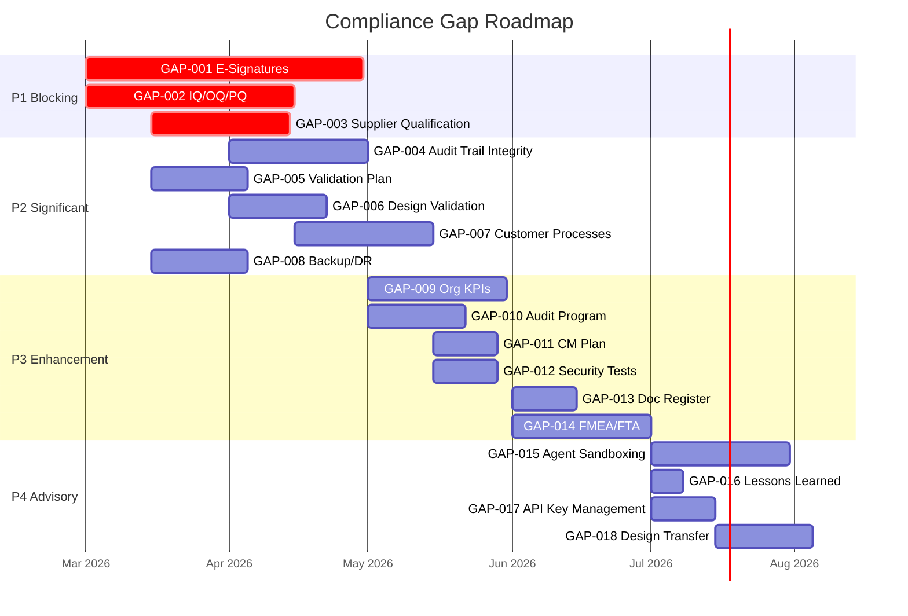

# Gap Analysis and Roadmap to Full Compliance

> **Document ID**: COMP-007
> **Version**: 1.3
> **Date**: 2026-02-21
> **Classification**: Public
> **Status**: Approved

[← Back to Documentation Hub](../README.md) | [← Previous: GxP / GAMP 5 Matrix](06_GXP_GAMP5_MATRIX.md)

---

## 1. Purpose

This document consolidates all compliance gaps from the per-standard matrices (COMP-002 through COMP-006) into a single prioritized roadmap. Each gap includes what it is, why it matters, which standards require it, and concrete steps to close it.

## 2. Gap Priority Levels

| Priority | Definition | Action Timeline |
|----------|-----------|----------------|
| **P1 -- Blocking** | Prevents certification or regulatory submission. Must be addressed before claiming compliance. | Before first regulated release |
| **P2 -- Significant** | Weakens compliance posture materially. Auditors will flag as a major finding. | Within first 2 cycles |
| **P3 -- Enhancement** | Strengthens compliance but absence is unlikely to block certification. Minor finding risk. | Within 6 months |
| **P4 -- Advisory** | Best practice. Improves maturity but not strictly required. | When capacity allows |

---

## 3. Consolidated Gap Register

### P1 -- Blocking Gaps

#### GAP-001: Electronic Signatures for Human Gates
| Attribute | Detail |
|-----------|--------|
| **Standards** | 21 CFR Part 11, Annex 11, ISO 13485 4.2.5 |
| **Current State** | APPROVALS.md captures name, role, timestamp, and signature method. No actual e-signature mechanism. |
| **Risk** | Gate approvals are non-repudiable only if signature infrastructure exists. Without it, any GxP submission is indefensible. |
| **Action Required** | 1. Implement PKI or digital signature infrastructure (GPG, organizational PKI, or qualified e-signature service). 2. Mandate `git commit -S` for all Gate approval commits. 3. Create a Signature Meaning Table (e.g., "Approved for release," "Reviewed," "Authored"). 4. Bind each GATE-XXXX record to a signed commit hash. 5. Verify signatures in the Compliance Auditor cycle boundary audit. |
| **Owner** | IT / Quality / DevOps |
| **Verification** | Attempt to forge a Gate approval; verify it is detected by signature verification. |

#### GAP-002: IQ/OQ/PQ for the AQMS Platform
| Attribute | Detail |
|-----------|--------|
| **Standards** | ISO 13485 4.1.6, GxP / GAMP 5 |
| **Current State** | No self-validation procedure for the AI agent platform. |
| **Risk** | Regulators can challenge whether the AI tooling itself is a validated system. |
| **Action Required** | 1. Create a Validation Plan for the Agile V AQMS (scope, approach, acceptance criteria). 2. IQ: Verify skill files are correctly installed and version-matched. 3. OQ: Run a reference project through the full pipeline; verify all agents produce expected outputs. 4. PQ: Run a production-representative project; verify traceability, Decision Log, and VER records are correct. 5. Document results in a Validation Report. 6. Trigger revalidation per the Periodic Review schedule. |
| **Owner** | Quality / Engineering |
| **Verification** | Present Validation Report to auditor; demonstrate revalidation trigger when model changes. |

#### GAP-003: LLM Provider Supplier Qualification
| Attribute | Detail |
|-----------|--------|
| **Standards** | AS9100D 8.4, ISO 13485 7.4 (if applicable) |
| **Current State** | `config.json` documents provider attributes. No evaluation, selection, or monitoring procedure. |
| **Risk** | LLM providers process requirements and code. An unqualified provider is a supply chain risk. |
| **Action Required** | 1. Define supplier evaluation criteria (data handling, SOC 2/ISO 27001 certification, data residency, SLA). 2. Evaluate each LLM provider against criteria; document in supplier register. 3. Define monitoring procedure (annual re-evaluation, incident tracking). 4. Flow down data handling requirements contractually (DPA). 5. Define fallback plan if provider becomes unavailable. |
| **Owner** | Procurement / IT / Quality |
| **Verification** | Supplier register exists with evaluation scores; DPA on file for each provider. |

---

### P2 -- Significant Gaps

#### GAP-004: Audit Trail Integrity Enforcement
| Attribute | Detail |
|-----------|--------|
| **Standards** | 21 CFR Part 11, GxP ALCOA+ (Original, Accurate), ISO 27001 A.8.9 |
| **Current State** | Append-only design intent. No technical enforcement at file level. |
| **Action Required** | 1. Implement per-entry hashing in Decision Log and Change Log (SHA-256 hash chain). 2. Write-protect archived cycle directories at the file system level. 3. Add integrity verification step to Compliance Auditor cycle boundary audit. 4. Consider database-backed logging for high-assurance environments. |
| **Owner** | Engineering / DevOps |

#### GAP-005: Validation Plan and System Description
| Attribute | Detail |
|-----------|--------|
| **Standards** | GxP / GAMP 5, ISO 13485 7.1 |
| **Current State** | No VP or System Description template. |
| **Action Required** | 1. Create a Validation Plan template that references Agile V pipeline stages. 2. Create a System Description template (system boundaries, data flows, user roles, interfaces). 3. Include these as mandatory inputs before Stage 1 in regulated projects. |
| **Owner** | Quality |

#### GAP-006: Design Validation (Distinct from Verification)
| Attribute | Detail |
|-----------|--------|
| **Standards** | ISO 13485 7.3.6, GxP |
| **Current State** | Verification and validation are conflated in the Red Team Verifier. |
| **Action Required** | 1. Add a "validation" checkpoint type after Gate 2 for regulated projects. 2. Define validation as testing in the intended-use environment (simulated or real). 3. Add `validation` as a test type in the Test Designer taxonomy. 4. Require validation protocol in REQUIREMENTS.md for medical/pharma projects. |
| **Owner** | Quality / Engineering |

#### GAP-007: Customer-Related Processes
| Attribute | Detail |
|-----------|--------|
| **Standards** | ISO 9001 5.1.2, ISO 13485 7.2 |
| **Current State** | No customer communication, regulatory requirement determination, or contract review. |
| **Action Required** | 1. Define a pre-pipeline phase: "Customer Requirements Review" that captures applicable regulations, customer needs, and contractual requirements. 2. Feed outputs into Requirement Architect as input constraints. 3. Implement customer feedback loop that generates CRs for next cycle. |
| **Owner** | Product / Quality |

#### GAP-008: Backup and Disaster Recovery
| Attribute | Detail |
|-----------|--------|
| **Standards** | ISO 27001 A.8.13, AS9100D 8.5.4, ISO 13485 4.2.5 |
| **Current State** | Git provides repository-level backup. No explicit backup procedure or verification. |
| **Action Required** | 1. Define backup frequency and retention for `.agile-v/` contents. 2. Implement automated backup verification (test restore quarterly). 3. Define disaster recovery procedure and RTO/RPO. |
| **Owner** | IT / DevOps |

---

### P3 -- Enhancement Gaps

#### GAP-009: Organizational QMS KPIs
| Attribute | Detail |
|-----------|--------|
| **Standards** | ISO 9001 4.4, 9.1 |
| **Action Required** | Define QMS-level KPIs (cross-project defect density, first-pass yield trends, average cycle time). Aggregate per-project metrics from compliance-auditor output. |

#### GAP-010: Audit Program
| Attribute | Detail |
|-----------|--------|
| **Standards** | ISO 9001 9.2 |
| **Action Required** | Define audit schedule (e.g., quarterly process audits, annual QMS audit). Assign auditors with documented independence. Track corrective actions from audits. |

#### GAP-011: Configuration Management Plan
| Attribute | Detail |
|-----------|--------|
| **Standards** | AS9100D 8.1.2 |
| **Action Required** | Create CM plan template that references `.agile-v/` structure, defines configuration baselines at Gate 2, and specifies configuration audit procedure. |

#### GAP-012: Security Test Type in Test Designer
| Attribute | Detail |
|-----------|--------|
| **Standards** | ISO 27001 A.8.29 |
| **Action Required** | Add `security` as a test type in the Test Designer taxonomy. Integrate SAST/DAST tools into CI pipeline. Include security test results in Validation Summary. |

#### GAP-013: Document Register and Distribution Control
| Attribute | Detail |
|-----------|--------|
| **Standards** | ISO 13485 4.2.4, ISO 9001 7.5 |
| **Action Required** | Create master document register for `.agile-v/` controlled documents. Define distribution lists. Implement obsolescence marking for superseded documents. |

#### GAP-014: Formal Risk Methodology (FMEA/FTA)
| Attribute | Detail |
|-----------|--------|
| **Standards** | AS9100D 8.1.1, ISO 13485 7.1 |
| **Action Required** | For hardware/safety-critical projects, conduct product-level FMEA or FTA. Feed results into REQUIREMENTS.md as constraints and into RISK_REGISTER.md. |

---

### P4 -- Advisory Gaps

#### GAP-015: Agent Sandboxing and Access Control Enforcement
| Attribute | Detail |
|-----------|--------|
| **Standards** | ISO 27001 A.8.3 |
| **Action Required** | Explore runtime-level agent isolation (restricted file access per agent role). Currently protocol-based only. |

#### GAP-016: Lessons Learned Mechanism
| Attribute | Detail |
|-----------|--------|
| **Standards** | ISO 9001 10.2 |
| **Action Required** | Conduct retrospectives at cycle boundaries. Record lessons learned in Decision Log with a `LESSON` tag. |

#### GAP-017: API Key Management for LLM Providers
| Attribute | Detail |
|-----------|--------|
| **Standards** | ISO 27001 A.8.5 |
| **Action Required** | Implement API key rotation schedule, scoped tokens, secure storage (vault/keychain). Document in security policy. |

#### GAP-018: Design Transfer Procedures
| Attribute | Detail |
|-----------|--------|
| **Standards** | ISO 13485 7.3.8 |
| **Action Required** | For products moving to manufacturing, create design transfer procedures linking Agile V outputs (Build Manifest, verified artifacts) to manufacturing specifications. |

---

## 4. Roadmap Visualization

## 5. How to Use This Roadmap

1. **Identify your regulatory context.** Not all gaps apply to all projects. A non-regulated web app needs none of these. A medical device needs P1 and P2. An aerospace system needs P1 + P2 + GAP-011 + GAP-014.
2. **Assign owners.** Each gap has a suggested owner role. Map to your team members.
3. **Track in your QMS.** These gaps should be entered as actions in your organizational QMS or project management system.
4. **Verify closure.** Each gap includes verification criteria. Confirm closure before claiming compliance.
5. **Re-audit periodically.** When skills are updated or your regulatory context changes, re-run the compliance audit. The documentation-agent can regenerate this documentation.

---

| Version | Date | Author | Changes |
|---------|------|--------|---------|
| 1.3 | 2026-02-21 | agile-v.org | Initial release |

[← Back to Documentation Hub](../README.md) | [← Previous: GxP / GAMP 5 Matrix](06_GXP_GAMP5_MATRIX.md)
